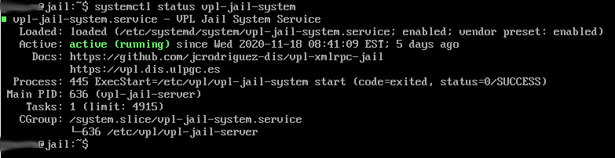
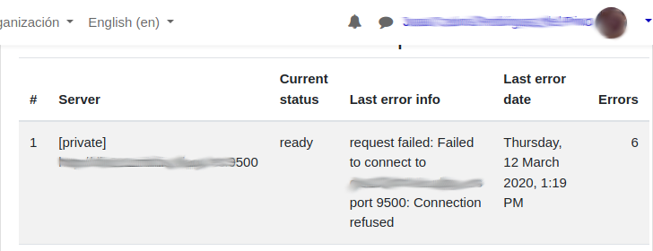

***************
Troubleshooting
***************

This document describes how can you check and troubleshooting the VPL-Jail-System.
For more details about VPL, visit the `VPL home page`_ or
the `VPL plugin page at Moodle`_.

.. _VPL home page: https://vpl.dis.ulpgc.es/
.. _VPL plugin page at Moodle: https://www.moodle.org/plugins/mod_vpl

Checking your server
--------------------

Service status
^^^^^^^^^^^^^^

You can check the status of the service using the following command in a terminal in your server 

Using systemd

.. code:: console

	systemctl status vpl-jail-system

or using system V

.. code:: console

	service vpl-jail-system status

  
    Example of systemctl output for an idle service

Accessible from a browser
^^^^^^^^^^^^^^^^^^^^^^^^^

You can check the availability of your execution server using the URL

\http://servername:PORT/OK and \https://servername:SECURE_PORT/OK

Where "servername" is the name of your execution server. The system must return a page with OK.

.. note:: The server must be accessible from the browser that uses VPL.

Accessible from Moodle
^^^^^^^^^^^^^^^^^^^^^^

After adding your new server to the list of execution servers in your Moodle.
You may go to "Advanced settings > Check execution servers" option of a VPL
activity and you must see your server with the *Current status* to *ready*. 

    Example of "Check execution servers" output

Troubleshooting
---------------

Reviewing logs
^^^^^^^^^^^^^^

You can obtain a detailed log of the execution process by changing the log level
at the configuration file. Commonly The logs will be written to "/var/log/syslog".

You may filter and explore the vpl logs with the following command

.. code:: console

   grep vpl /var/log/syslog | less

Reporting a bug
^^^^^^^^^^^^^^^

.. _Github repository: https://github.com/jcrodriguez-dis/vpl-xmlrpc-jail/issues

If you think you found a bug, please, report it at the `Github repository`_.

Please, describe your system configuration and *how to reproduce* the problem. Typical system configuration contains:

- Operating system version
- VPL-jail-system version
- VPL-jail-system configuration file content
- Network configuration (how your system reach the internet)
- Screenshots
- Other data you think is relevant

Asking for help
^^^^^^^^^^^^^^^

.. _VPL Moodle forum: https://moodle.org/mod/forum/view.php?id=8672

If you don't found the problem, ask for help in the `VPL Moodle forum`_.

Please, describe your system configuration and *how to reproduce* the problem. Typical system configuration contains:

- Operating system version
- VPL-jail-system version
- VPL-jail-system configuration file content
- Network configuration (how your system reach the internet)
- Screenshots
- Other data you think is relevant
